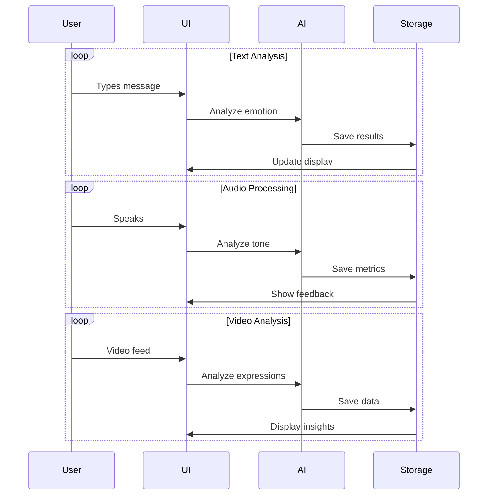
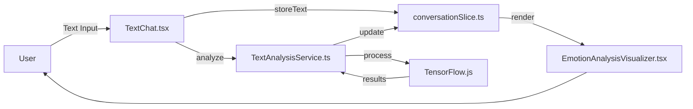
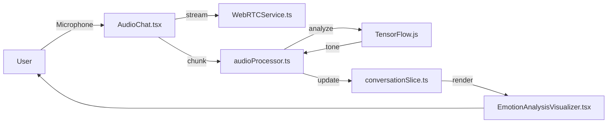
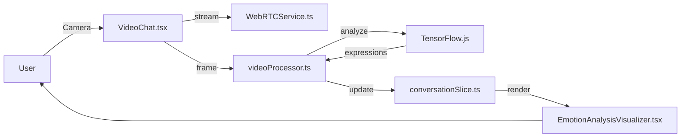
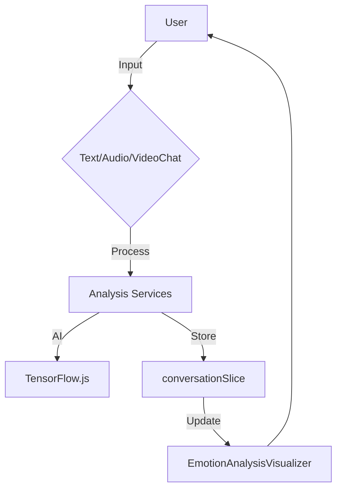

# AI Communication Companion

A secure, AI-powered emotional assistant that enhances communication across text, audio, and video conversations.

## Vision

Empowering better communication through real-time emotional intelligence, while maintaining user privacy and control.

## Key Features

- 🎯 **Emotion-Aware Analysis**: Real-time detection of emotional states, stress levels, and conversation dynamics
- 💡 **Live Communication Guidance**: Contextual suggestions for better communication
- 📊 **Smart Summaries**: Automated insights and action items from conversations
- 🔒 **Privacy-First**: Local-first architecture with user-controlled data sharing
- 🎥 **Multi-Modal Support**: Works with text, audio, and video communications

## Tech Stack

- **Frontend**: Next.js with TypeScript
- **Backend**: Node.js with Express
- **AI Processing**: TensorFlow.js for local processing
- **Real-time Communication**: WebRTC
- **State Management**: Redux Toolkit
- **Styling**: Tailwind CSS
- **Testing**: Jest and React Testing Library

## Getting Started

1. Clone the repository
2. Install dependencies:
   ```bash
   npm install
   ```
3. Set up environment variables:
   ```bash
   cp .env.example .env.local
   ```
4. Start the development server:
   ```bash
   npm run dev
   ```

## Project Structure

```
├── src/
│   ├── components/     # Reusable UI components
│   ├── pages/         # Next.js pages and API routes
│   ├── services/      # Core services (AI, WebRTC, etc.)
│   ├── store/         # Redux Toolkit store and slices
│   ├── styles/        # Global styles
│   └── types/         # TypeScript type definitions
├── public/           # Static assets
├── scripts/          # Utility scripts
├── tests/           # Test files
└── docs/            # Documentation
```

## Project Flow

### Real-Time Processing Animation



### Processing Flow Visualization
🔄 `User Input` → 🎤 `Audio` → 🧠 `AI Analysis` → 💡 `Insights`  
🔄 `User Input` → 📝 `Text` → 🧠 `AI Analysis` → 💡 `Insights`  
🔄 `User Input` → 🎥 `Video` → 🧠 `AI Analysis` → 💡 `Insights`

### Communication-Type Specific Architectures

#### Text Communication Flow


**Key Components**:
- `src/components/TextChat.tsx`: Text input interface
- `src/services/TextAnalysisService.ts`: Text processing service
- `src/store/slices/conversationSlice.ts`: Redux storage
- `src/components/EmotionAnalysisVisualizer.tsx`: Visualization component

#### Audio Communication Flow


**Key Components**:
- `src/components/AudioChat.tsx`: Audio interface
- `src/services/WebRTCService.ts`: Real-time communication
- `src/scripts/audioProcessor.ts`: Audio processing scripts
- `src/services/AudioAnalysisService.ts`: Audio analysis service

#### Video Communication Flow


**Key Components**:
- `src/components/VideoChat.tsx`: Video interface
- `src/scripts/videoProcessor.ts`: Frame processing
- `src/services/VideoAnalysisService.ts`: Video analysis
- Shared `conversationSlice.ts` for state management

### Unified Component Flow


### Detailed Interaction Flow

#### Text Interface
1. **User Input**: Text is entered into the UI via `src/components/TextChat.tsx`.
2. **Component Handling**: The `src/components/TextChat.tsx` dispatches a Redux action (`storeText`) to temporarily store the text in `src/store/slices/conversationSlice.ts`.
3. **AI Processing**: The `src/services/TextAnalysisService.ts` sends the text to `TensorFlow.js` (`emotionDetectionModel`).
4. **Feedback**: Results are stored in `conversationSlice` and displayed via `src/components/EmotionAnalysisVisualizer.tsx`.

#### Audio Interface
1. **User Input**: Audio is captured via `src/components/AudioChat.tsx` (using browser's `MediaRecorder` API).
2. **Component Handling**: The `src/scripts/audioProcessor.ts` processes the stream via `src/services/WebRTCService.ts` (`audioStreamModule`) or stores it locally (`localAudioStorage`).
3. **AI Processing**: The `src/services/AudioAnalysisService.ts` sends data to `TensorFlow.js` (`toneAnalysisModel`).
4. **Feedback**: Real-time suggestions are rendered by `src/components/EmotionAnalysisVisualizer.tsx`.

#### Video Interface
1. **User Input**: Video is captured via `src/components/VideoChat.tsx` (using browser's `getUserMedia` API).
2. **Component Handling**: Frames are processed by `src/scripts/videoProcessor.ts` via `WebRTCService.ts` (`videoStreamModule`) or analyzed locally (`localFrameAnalysis`).
3. **AI Processing**: The `src/services/VideoAnalysisService.ts` uses `TensorFlow.js` (`facialExpressionModel`).
4. **Feedback**: Insights are displayed by `src/components/EmotionAnalysisVisualizer.tsx`.

### Contribution Workflow

We welcome contributions! Please follow these steps:
1. Fork and clone the repository.
2. Install dependencies (`npm install`).
3. Set up environment variables (`cp .env.example .env.local`).
4. Make your changes and ensure they adhere to the project's coding standards.
5. Test your changes thoroughly.
6. Submit a pull request with a clear description of your changes.
Please refer to the [CONTRIBUTING.md](CONTRIBUTING.md) file for more detailed guidelines.

### User Interaction Flow

Users interact with the application through its frontend interface.
1.  The application integrates with communication platforms to access text, audio, or video streams (details of integration mechanisms are handled within the services layer).
2.  Real-time data is fed to the local AI processing module (TensorFlow.js).
3.  Emotion analysis and communication dynamics are detected locally.
4.  The application provides real-time feedback and suggestions to the user based on the analysis.
5.  Optionally, conversations can be summarized, and action items are generated, stored locally, and accessible via the UI.
6.  User settings control privacy preferences and data sharing options.
