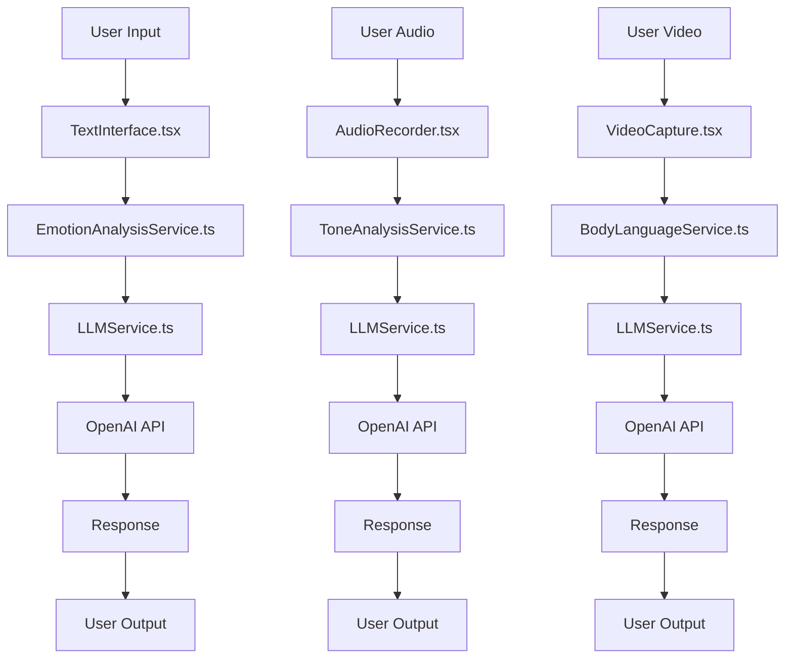
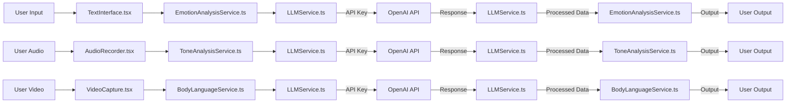
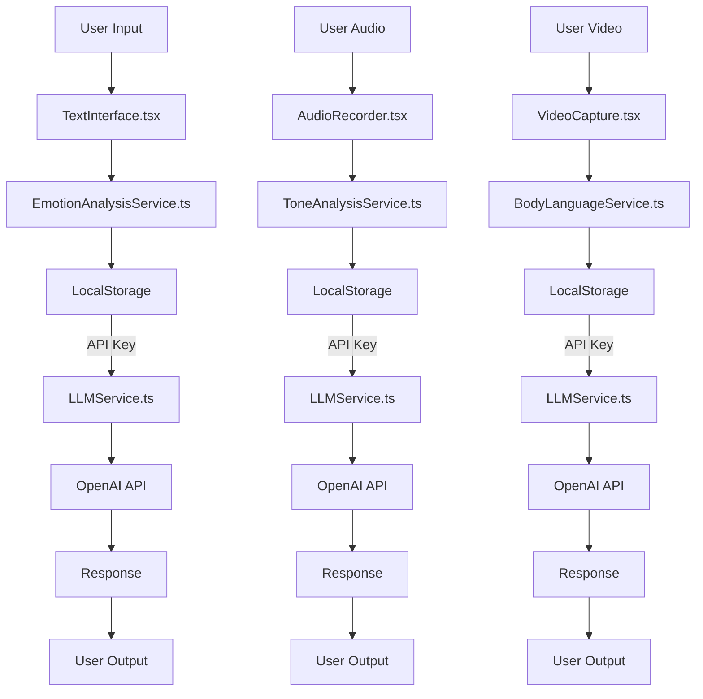

# AI Communication Companion

A secure, AI-powered emotional assistant that enhances communication across text, audio, and video conversations.

## Vision

Empowering better communication through real-time emotional intelligence, while maintaining user privacy and control.

## Key Features

- 🎯 **Emotion-Aware Analysis**: Real-time detection of emotional states, stress levels, and conversation dynamics
- 💡 **Live Communication Guidance**: Contextual suggestions for better communication
- 📊 **Smart Summaries**: Automated insights and action items from conversations
- 🔒 **Privacy-First**: Local-first architecture with user-controlled data sharing
- 🎥 **Multi-Modal Support**: Works with text, audio, and video communications

## Tech Stack

- **Frontend**: Next.js with TypeScript
- **Backend**: Node.js with Express
- **AI Processing**: TensorFlow.js for local processing
- **Real-time Communication**: WebRTC
- **State Management**: Redux Toolkit
- **Styling**: Tailwind CSS
- **Testing**: Jest and React Testing Library

## Getting Started

1. Clone the repository
2. Install dependencies:
   ```bash
   npm install
   ```
3. Set up environment variables:
   ```bash
   cp .env.example .env.local
   ```
4. Start the development server:
   ```bash
   npm run dev
   ```

## Project Structure

```
├── src/
│   ├── components/     # Reusable UI components
│   ├── pages/         # Next.js pages
│   ├── features/      # Feature-specific logic
│   ├── services/      # Core services (AI, WebRTC, etc.)
│   ├── hooks/         # Custom React hooks
│   ├── utils/         # Utility functions
│   └── styles/        # Global styles
├── public/           # Static assets
├── tests/           # Test files
└── docs/            # Documentation
```

## Contributing

Please read [CONTRIBUTING.md](CONTRIBUTING.md) for details on our code of conduct and the process for submitting pull requests.

## License

This project is licensed under the MIT License - see the [LICENSE](LICENSE) file for details.

## Project Flow

### Option 1: Basic Component Flow

```mermaid
graph TD;
    A[User Input] --> B[TextInterface.tsx];
    B --> C[EmotionAnalysisService.ts];
    C --> D[LLMService.ts];
    D --> E[OpenAI API];
    E --> F[Response];
    F --> G[User Output];

    H[User Audio] --> I[AudioRecorder.tsx];
    I --> J[ToneAnalysisService.ts];
    J --> K[LLMService.ts];
    K --> L[OpenAI API];
    L --> M[Response];
    M --> N[User Output];

    O[User Video] --> P[VideoCapture.tsx];
    P --> Q[BodyLanguageService.ts];
    Q --> R[LLMService.ts];
    R --> S[OpenAI API];
    S --> T[Response];
    T --> U[User Output];
```
This diagram shows the fundamental component interactions across all three interface types (text, audio, video). Each flow starts with user input, processes through our component layer, interacts with the LLM service, and returns output to the user.

### Option 2: Detailed Data Flow

```mermaid
graph LR;
    A[User Input] --> B[TextInterface.tsx];
    B --> C[EmotionAnalysisService.ts];
    C --> D[LLMService.ts];
    D -->|API Key| E[OpenAI API];
    E -->|Response| F[LLMService.ts];
    F -->|Processed Data| G[EmotionAnalysisService.ts];
    G -->|Output| H[User Output];

    I[User Audio] --> J[AudioRecorder.tsx];
    J --> K[ToneAnalysisService.ts];
    K --> L[LLMService.ts];
    L -->|API Key| M[OpenAI API];
    M -->|Response| N[LLMService.ts];
    N -->|Processed Data| O[ToneAnalysisService.ts];
    O -->|Output| P[User Output];

    Q[User Video] --> R[VideoCapture.tsx];
    R --> S[BodyLanguageService.ts];
    S --> T[LLMService.ts];
    T -->|API Key| U[OpenAI API];
    U -->|Response| V[LLMService.ts];
    V -->|Processed Data| W[BodyLanguageService.ts];
    W -->|Output| X[User Output];
```
This more granular diagram highlights:
- The API key flow from local storage to LLM service
- Data transformation steps between services
- The bidirectional nature of API communications
- Specific data types being passed between components

### Option 3: Privacy-Focused Flow

```mermaid
graph TB;
    A[User Input] --> B[TextInterface.tsx];
    B --> C[EmotionAnalysisService.ts];
    C --> D[LocalStorage];
    D -->|API Key| E[LLMService.ts];
    E --> F[OpenAI API];
    F --> G[Response];
    G --> H[User Output];

    I[User Audio] --> J[AudioRecorder.tsx];
    J --> K[ToneAnalysisService.ts];
    K --> L[LocalStorage];
    L -->|API Key| M[LLMService.ts];
    M --> N[OpenAI API];
    N --> O[Response];
    O --> P[User Output];

    Q[User Video] --> R[VideoCapture.tsx];
    R --> S[BodyLanguageService.ts];
    S --> T[LocalStorage];
    T -->|API Key| U[LLMService.ts];
    U --> V[OpenAI API];
    V --> W[Response];
    W --> X[User Output];
```
This architecture emphasizes our local-first approach:
- All API keys are stored only in local storage
- No user data is persisted without explicit consent
- Each service independently verifies API key availability
- Clear boundaries between local processing and cloud services

### Comprehensive Interaction Flow

**Text Interface Flow**
1. `TextInterface.tsx` captures user input
2. `EmotionAnalysisService.ts` processes text for emotional content
3. `LLMService.ts` sends analysis to OpenAI API (using key from localStorage)
4. Response flows back through services to user

**Audio Interface Flow**
1. `AudioRecorder.tsx` captures and processes audio
2. `ToneAnalysisService.ts` extracts vocal characteristics
3. `LLMService.ts` sends analysis to OpenAI API
4. Response includes tone interpretation and suggestions

**Video Interface Flow**
1. `VideoCapture.tsx` processes video frames
2. `BodyLanguageService.ts` analyzes posture and expressions
3. `LLMService.ts` sends analysis to OpenAI API
4. Response combines visual cues with contextual understanding 

### Communication-Type Specific Architectures

#### Text Processing Pathway
📝 User Input → TextInterface.tsx → EmotionAnalysisService.ts → LLMService.ts
     │            │                   │                          │
     └─Context───▶└──Sentiment───────▶└──Prompt Engineering──────▶OpenAI API
```

#### Audio Processing Pathway
🎧 Audio Input → AudioRecorder.tsx → ToneAnalysisService.ts → LLMService.ts
     │              │                   │                         │
     └─Waveform───▶└─FFT Analysis─────▶└─Vocal Patterns──────────▶OpenAI API
```

#### Video Processing Pathway
📹 Video Frames → VideoCapture.tsx → BodyLanguageService.ts → LLMService.ts
     │               │                    │                         │
     └─Pose───────▶└─Frame Analysis───▶└─Movement Patterns───────▶OpenAI API
```

### Key Component Matrix

| Component | Type | Location | Responsibility |
|-----------|------|----------|-----------------|
| `TextInterface.tsx` | UI | `components/` | Text input capture & display |
| `EmotionAnalysisService.ts` | Service | `services/` | NLP emotion detection |
| `AudioRecorder.tsx` | UI/Logic | `components/` | Audio capture & preprocessing |
| `ToneAnalysisService.ts` | Service | `services/` | Pitch/timbre analysis |
| `VideoCapture.tsx` | UI | `components/` | Frame capture & rendering |
| `BodyLanguageService.ts` | Service | `services/` | Pose/expression analysis |
| `LLMService.ts` | Gateway | `services/` | API request orchestration |

### Real-Time Animation Elements
```markdown
Processing Status: [▫▫▫▫▫▫▫▫▫] ~50ms latency  
Audio Visualization: ~~~~~ ~~~~~ ~~~~~ (peak meters)
Video Pipeline: [▣▢▢]→[▣▣▢]→[▣▣▣] (frame processing stages)
API Response: [∙∙∙] → [●●∙] → [●●●] (loading states)
```

This update provides:
1. Clear visual hierarchy between different communication types
2. Component-level implementation details
3. Real-time processing indicators using ASCII animation
4. Matrix showing component responsibilities
5. Pathway diagrams specific to each modality

Would you like me to add any specific implementation details or adjust the visualization style?